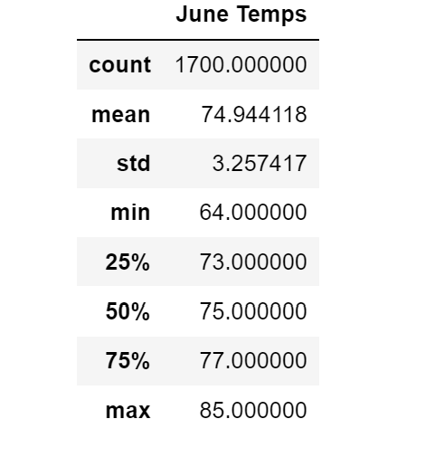
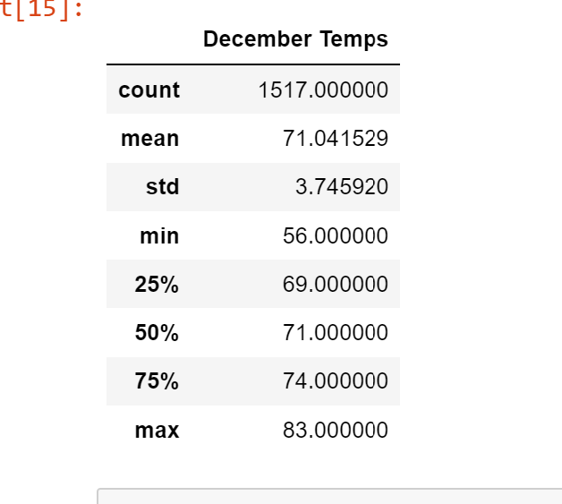

# Surfs_up

SQLite to store the weather data. 
SQLAlchemy, Python, Pandas functions and methods 

## Overview of the analysis: 

The goal of this analysis to to provide an insight into the weather patterns of a specific location on Oahu. The data included recording stations, precipitation, and temperatures on a daily basis from year 2010 to year 2017. The analysis results are summary statistics of temperatures and precipitations, and activities of recording stations.

## Challenge

Create a summary statistics for June and December.

## Results:

   
 
 
 
 
  
Looking at the results, there are three key differences in the weather between June and December:
 1. Temperature range: using the percentile, The range of temperatures in the month of June are between 73 degrees 
     and 77 degrees and between 69 degrees and 74 degrees in December. The differences are about 3 to 4 degrees warmer in June.
 2. Extreme temperature range: using maximum and minimum, June maximum temperature is 85 degrees and minimum temperature is 64 degrees, December maximum temperature is 83 degrees and minimum temperature is 56 degrees. That is about 21 degrees fluctuation in June and 27 degrees fluctuation in December.
 3. Average temperature: June is 74.9 degrees and in December is 71.0 degrees. That is 4 degrees warmer in June.   

## Summary: 

Looking at the summary of different statistics for the temperature in June and December:
   - the temperature range in June is about 3-4 degrees warmer than in December. 
   - The temperature fluctuation is about 6 degrees less in June.  
   - The average temperature is about 4 degrees warmer in June. 
        
The conclusions is, June seems to be a good month to open the shop.  However, there are two additional queries that I would perform to gather more weather data for June and December:

   1. The amount of precipitation, too many rainy day can affect the income of the business.
   2. The stations activity, the station with more activity can possibly give more accurate weather data. 
        
